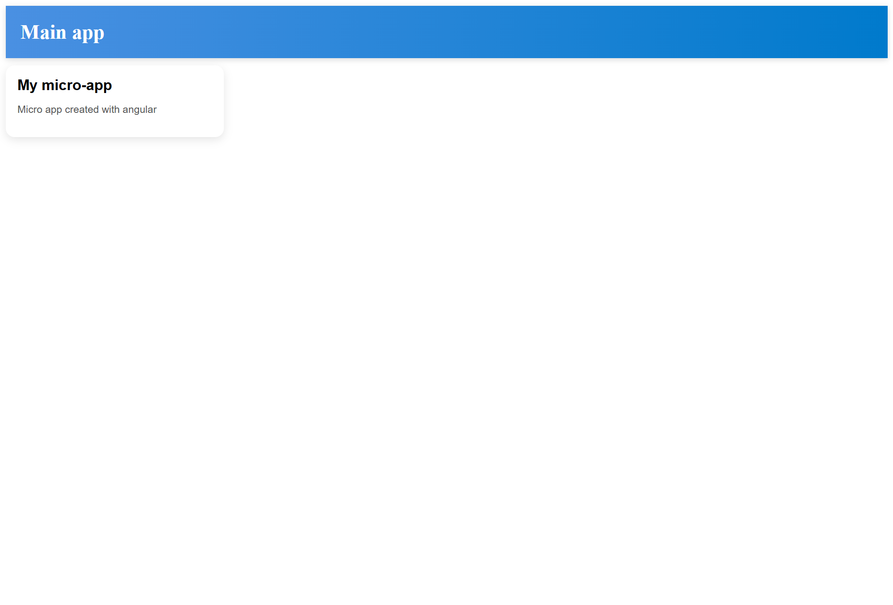

# Main App (host) for Microfrontend demo project.

**PORT:** 4200

## Structure: 

```
├── public
│ ├── favicon.ico
├── src
│ ├── app - page with main app
│ │ │ ├── app.config.ts
│ │ │ ├── app.html - main page with remote app
│ │ │ ├── app.routes.ts
│ │ │ ├── app.scss - styles main page
│ │ │ ├── app.spec.ts
│ │ │ ├── app.ts - connect remote
│ ├── assets
│ ├── bootstrap.ts
│ ├── index.html
│ ├── main.ts
│ └── styles.scss
├── .editorconfig
├── .gitignore
├── angular.json
├── package.json
├── README.md
├── tsconfig.app.json
├── tsconfig.json
├── tsconfig.spec.json
├── webpack.config.js - settings for host (main app)
├── webpack.prod.config.js
└── yarn.lock
```



Start dev: ng serve